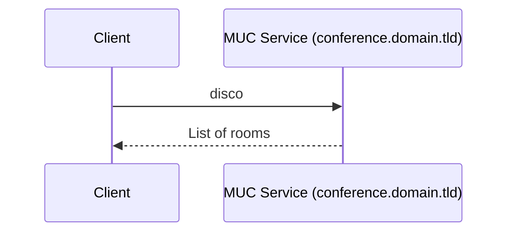
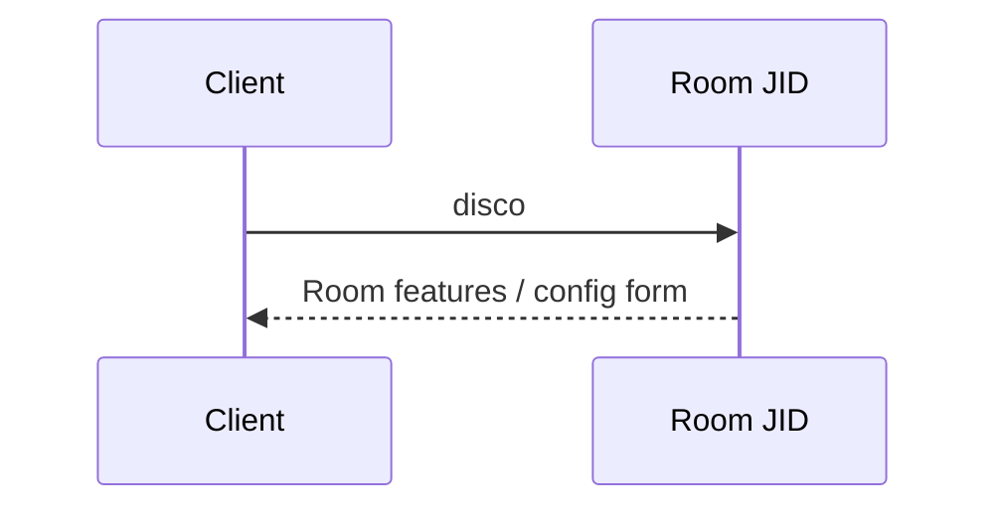
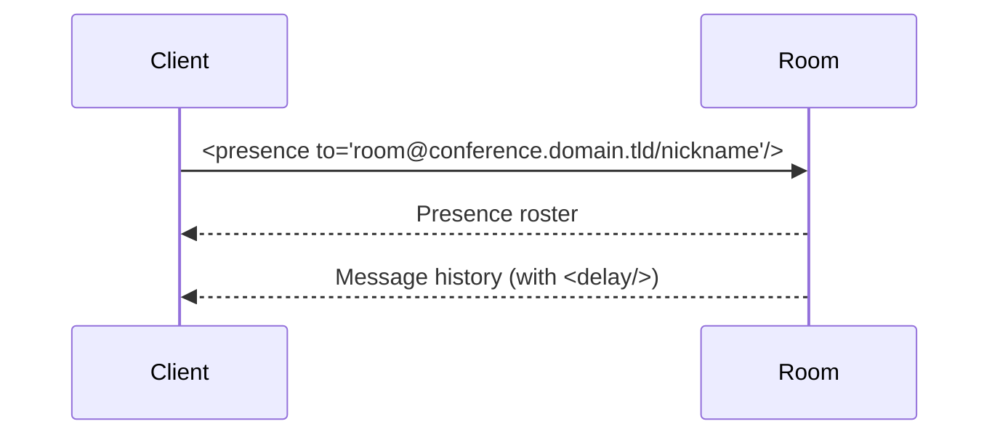
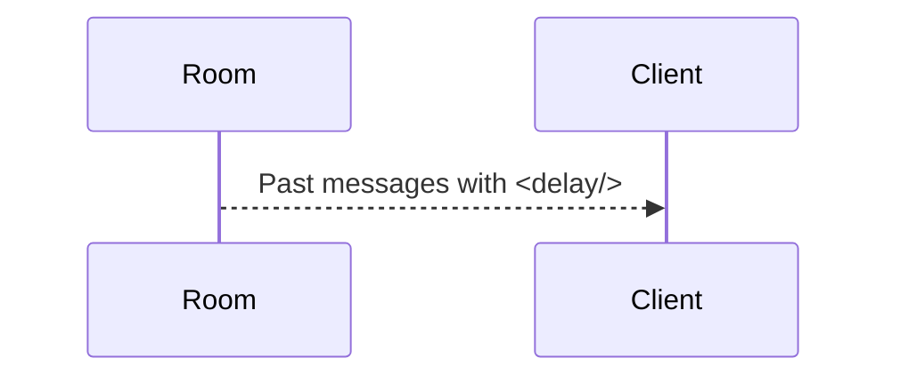
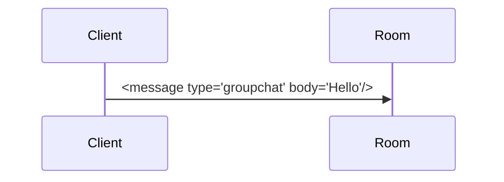
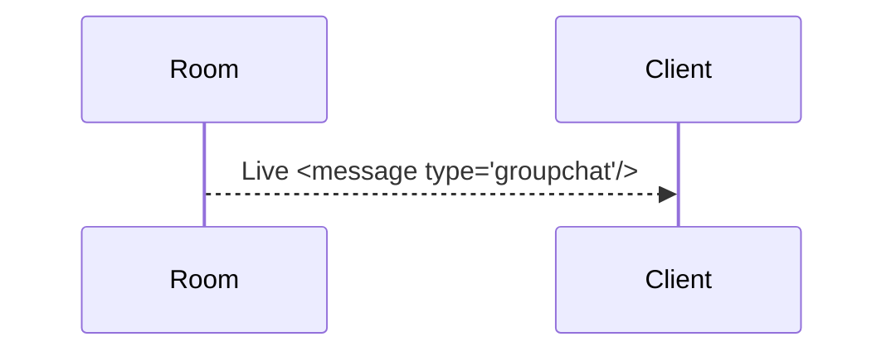
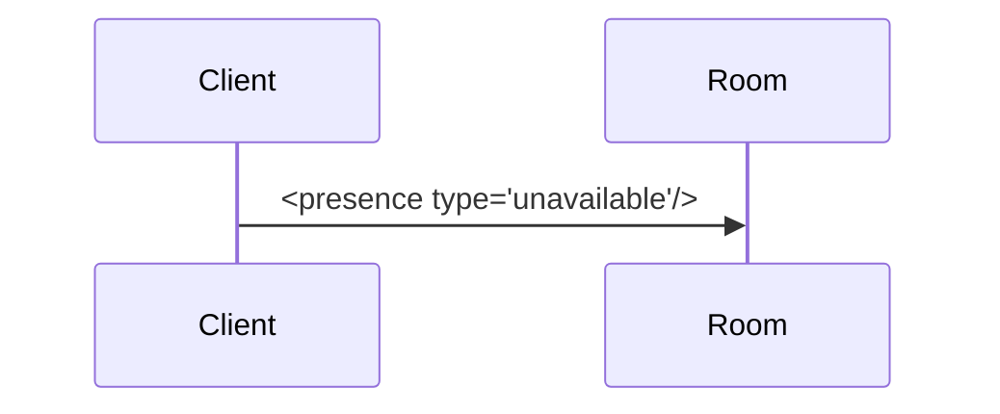

# 💬 Using MUC (Multi-User Chat) with stanza.io and OpenFire

This guide walks through how to use `stanza.io` to interact with XMPP MUC (Multi-User Chat) rooms hosted on an OpenFire server.

It includes discovering rooms, retrieving configuration, joining, fetching messages, sending/receiving, and leaving a room.

---

## 🔍 1. Discovering Available Rooms



Use service discovery to find the MUC service and available rooms.

```js
const mucService = 'conference.domain.tld';

client.getDiscoItems(mucService).then((res) => {
  console.log('Available rooms:', res.items);
});
```

---

## ⚙️ 2. Discover Room Configuration



To get metadata and configurable features for a room:

```js
client.getDiscoInfo('room@conference.domain.tld').then((res) => {
  console.log('Room features:', res.features);
});
```

To fetch full room configuration form:

```js
client.getMUCRoomConfig('room@conference.domain.tld').then((res) => {
  console.log('Room config form:', res.form);
});
```

---

## 🚪 3. Joining a Room



To join a room, use `joinRoom()`:

```js
client.joinRoom('room@conference.domain.tld', 'nickname');
```

You may receive presence updates and the room's history (see next section).

---

## 📨 4. Receiving Existing Messages (History)



Listen like so:

```js
client.on('message', (msg) => {
  if (msg.muc) {
    const isDelayed = !!msg.delay;
    console.log(isDelayed ? '[History]' : '[Live]', msg.body);
  }
});
```

---

## ✉️ 5. Sending Messages to the Room



Use `sendMessage()` with the room JID:

```js
client.sendMessage({
  to: 'room@conference.domain.tld',
  type: 'groupchat',
  body: 'Hello, everyone!'
});
```

---

## 📬 6. Receiving Live Messages



Set up a message listener:

```js
client.on('message', (msg) => {
  if (msg.type === 'groupchat' && msg.body) {
    console.log(`[${msg.from}] ${msg.body}`);
  }
});
```

---

## 🚪 7. Leaving the Room



To leave the room:

```js
client.leaveRoom('room@conference.domain.tld', 'nickname');
```

This sends `<presence type='unavailable'/>` to the MUC service.

---

## 🧾 stanza.io API Summary

| Operation             | Method |
|-----------------------|--------|
| Discover rooms        | `getDiscoItems(mucService)` |
| Get room info         | `getDiscoInfo(roomJID)` |
| Get room config       | `getMUCRoomConfig(roomJID)` |
| Join room             | `joinRoom(roomJID, nickname)` |
| Send message          | `sendMessage({ to, type, body })` |
| Receive messages      | `client.on('message', cb)` |
| Leave room            | `leaveRoom(roomJID, nickname)` |

---

## ⚠️ Notes

- OpenFire uses `conference.domain.tld` by default for MUC.
- Joining a room may create it automatically if it doesn't exist and the server allows it.
- Some rooms may be members-only or require a password (you can extend `joinRoom()` to include it).
- Use `client.getMUCRoomMembers()` to list users, if needed.

---

Let me know if you want this turned into a UI checklist or full visual chat workflow!
