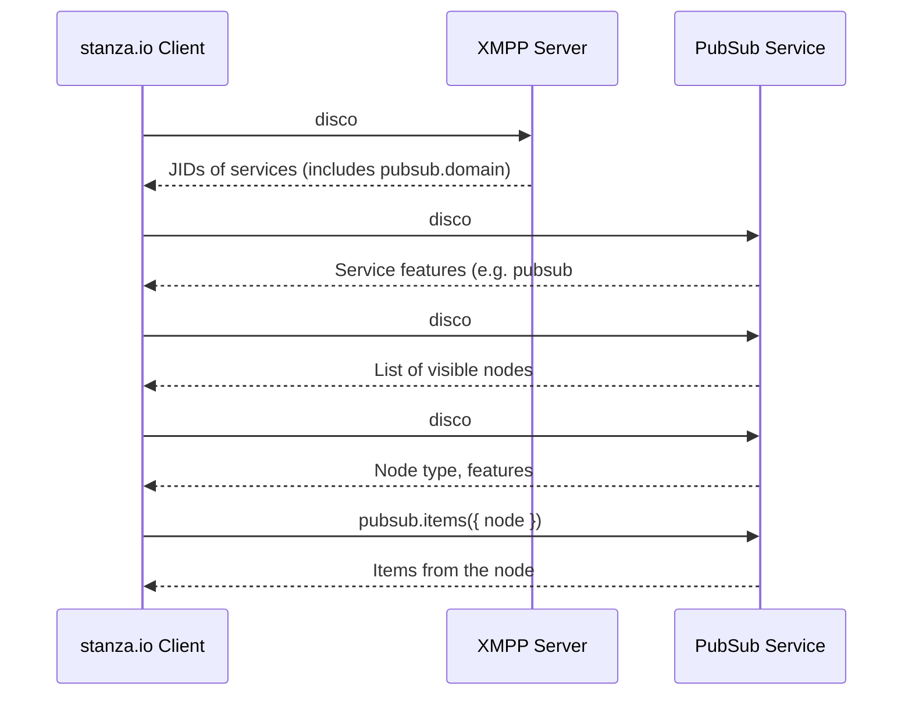
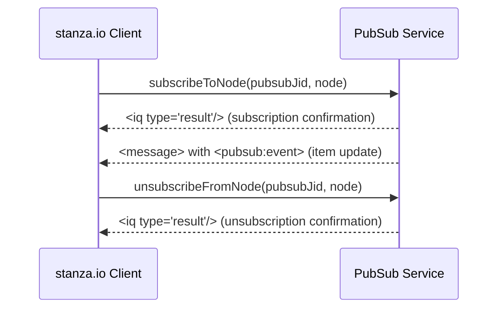

# 📘 XMPP PubSub Discovery and Reading using stanza.io

This document outlines the sequence of operations an XMPP client using `stanza.io` must perform to discover a PubSub service, list visible nodes, and retrieve items (documents).

A lower section covers [subscribing to nodes for real-time updates](#-subscribing-to-xmpp-pubsub-nodes-using-stanzaio).

---

## 🧭 Overview

1. Connect to the XMPP server.
2. Discover PubSub service via service discovery.
3. Discover PubSub capabilities.
4. List visible PubSub nodes.
5. Optionally inspect a node's metadata.
6. Retrieve items from a specific node.

---

## 📘 Mermaid Sequence Diagram



---

## 🛠️ stanza.io Code Concepts

| Step | stanza.io API |
|------|---------------|
| Connect | `client.connect()` |
| Disco#Items (domain) | `client.getDiscoItems(jid)` |
| Disco#Info (pubsub) | `client.getDiscoInfo(jid)` |
| Disco#Items (pubsub nodes) | `client.getDiscoItems(pubsubJid)` |
| Disco#Info (node metadata) | `client.getDiscoInfo(pubsubJid, node)` |
| Get node items | `client.getItems({ to: pubsubJid, node })` |

> Note: `pubsubJid` is typically something like `pubsub.domain.tld`.

---

## 🔐 Permissions

Ensure the PubSub nodes are configured with proper access model:
- `open` — anyone can subscribe
- `presence` — only contacts can
- `whitelist` or `authorize` — explicit permissions

This depends on the server-side (e.g., OpenFire) configuration.

---

## 📡 Subscribing to XMPP PubSub Nodes using stanza.io

This guide shows how to subscribe to updates from XMPP PubSub nodes using the `stanza.io` JavaScript library, receive real-time document updates, and unsubscribe when needed.

---

## 🔁 Subscription Flow (Mermaid Diagram)



---

## 🛠️ Subscribing to a PubSub Node

Use `client.subscribeToNode()` to register for updates.

```js
client.subscribeToNode('pubsub.domain.tld', 'example/node');
```

This sends a `subscribe` request to the PubSub service. If the node is open or your JID is authorized, you’ll start receiving push updates.

---

## 📬 Receiving Updates

Listen for published items using:

```js
client.on('pubsub:event', msg => {
    const { node, items } = msg.pubsubEvent;
    console.log(`📥 New item(s) on node: ${node}`, items);
});
```

Example stanza received:

```xml
<message from='pubsub.domain.tld' to='client@domain/resource'>
  <event xmlns='http://jabber.org/protocol/pubsub#event'>
    <items node='example/node'>
      <item id='item123'>
        <entry xmlns='http://www.w3.org/2005/Atom'>
          <title>Update Title</title>
        </entry>
      </item>
    </items>
  </event>
</message>
```

---

## 🧹 Unsubscribing from a Node

Stop receiving updates with:

```js
client.unsubscribeFromNode('pubsub.domain.tld', 'example/node');
```

This sends an `unsubscribe` IQ stanza to the PubSub service, ending delivery of future events to your JID.

---

## 🧾 stanza.io API Summary

| Operation     | Method                                      |
|---------------|---------------------------------------------|
| Subscribe     | `client.subscribeToNode(pubsubJid, node)`   |
| Receive Items | `client.on('pubsub:event', callback)`       |
| Unsubscribe   | `client.unsubscribeFromNode(pubsubJid, node)`|

---

## ⚠️ Notes

- Subscriptions are **JID-specific**: each connected resource (device) must subscribe individually.
- Subscriptions may require approval depending on the **access model** of the node (`open`, `presence`, `authorize`, etc.).
- To persist subscriptions across sessions, ensure `persistent` subscriptions are supported/configured server-side.

